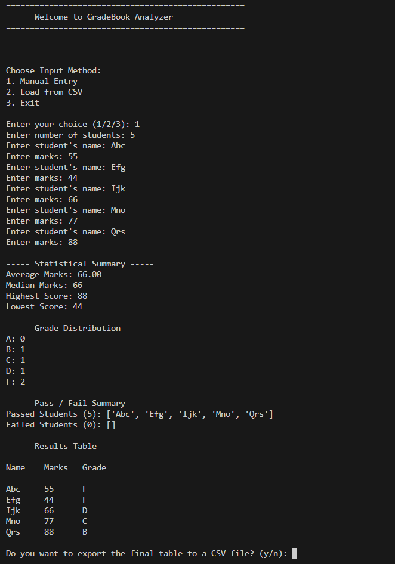
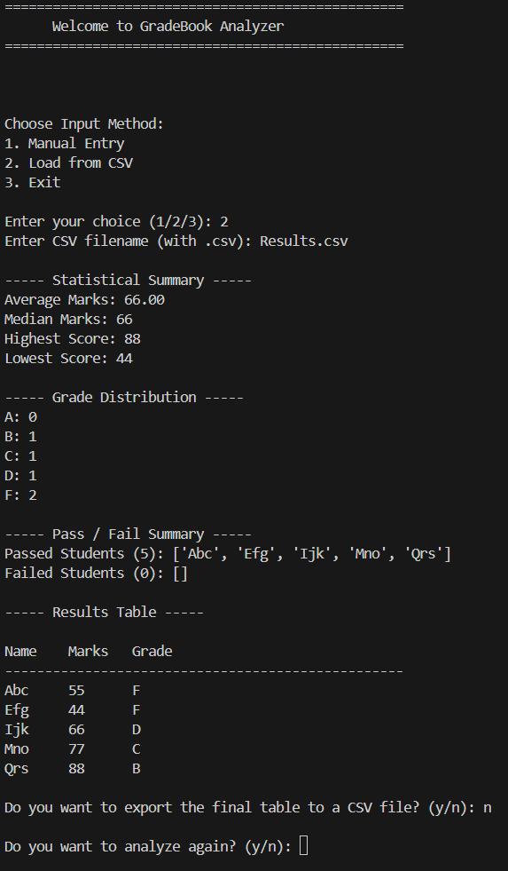

# grade analyzer py

# GradeBook Analyzer

A Python-based command-line tool for loading, analyzing, grading, and exporting student mark data.

## Project Overview

Lecturers often need a fast and accurate way to compute statistics on student marks. The **GradeBook Analyzer** automates this workflow by:

* Loading data from manual input or a CSV file
* Computing key statistics (average, median, min, max)
* Assigning letter grades based on score ranges
* Counting grade distribution
* Filtering pass/fail students using list comprehensions
* Displaying a formatted table of results
* Exporting the final report to a CSV file

This project demonstrates practical usage of functions, loops, conditionals, dictionaries, list comprehensions, CSV handling, and CLI design.

---

##  Features

### Input Methods

* **Manual entry** of student names and marks
* **CSV import** (`name, marks` format)

### Statistical Analysis

* Average
* Median
* Maximum score
* Minimum score

### Grade Assignment

Grade rules:

* **A:** 90+
* **B:** 80–89
* **C:** 70–79
* **D:** 60–69
* **F:** Below 60

### Grade Distribution Summary

Automatically counts how many students received A–F.

### Pass/Fail Filter

* Pass: marks ≥ 40
* Fail: marks < 40
* Implemented using Python list comprehensions

### Formatted Results Table

Displays:

```
Name    Marks    Grade
--------------------------
Alice   78       C
Bob     92       A
```

### CSV Export

Exports the final table (Name, Marks, Grade) to a CSV file.

---
## Screenshots
### Manual Entry

### csv Entry

---

## Tech Used

* Python 3
* Built-in modules: `csv`
* No external dependencies

---

## How to Run

```bash
python gradebook_analyzer.py
```

Follow the on-screen menu to:

1. Enter data manually or load a CSV
2. View analysis summary
3. View grade distribution
4. See pass/fail lists
5. Export the table if desired

---
## CSV Format Example

Input CSV file should look like:

```
Name,Marks
Alice,78
Bob,92
Charlie,55
```

---

## Exported CSV Example

Automatically generated after analysis:

```
Name,Marks,Grade
Alice,78,C
Bob,92,A
Charlie,55,F
```

---

## Learning Objectives Achieved

* Reading input and CSV files
* Using dictionaries for structured data
* Implementing custom statistical functions
* Applying conditional logic for grading
* Using list comprehensions for filtering
* Creating a loop-based CLI
* Producing formatted and exported output

---
